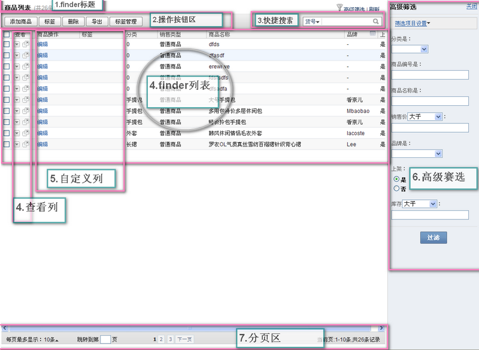
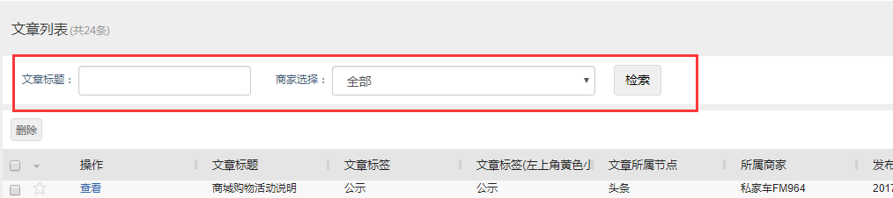

# finder的使用

首先我们了解一下，finder展示在什么地方，如下如↓



finder展示区由7分部组成，分别是：

1. finder标题
2. 操作按钮区
3. 快捷搜索
4. 查看列
5. 自定义列
6. 高级筛选
7. 分页区

> 我们平时做任何web应用大概都少不了后台管理功能， 这之中最常看到的大概就是：数据列表，对数据进行单条查看，删除，搜索列表数据。finder就是做这样工作的，要做到这些事情只需简单的给一个方法传几个参数而已

## 调用finder方法

1.控制器继承`desktop_controller`类，`desktop_controller`类封装了`finder()`方法。

2.控制器方法调用`finer()`方法，`$this->finder()`;

例子：

```text
class testapp_ctl_test extends desktop_controller{
	function index()
	{
	   $this->finder(
		   'testapp_mdl_test',
		   array(
			   'title'=>app::get('testapp')->_('finder标题'),
			   'actions'=>array(
				   array(
					   'label'=>app::get('testapp')->_('按钮名称'),
					   'href'=>'?app=testapp&ctl=test&act=add','target'=>'_blank'
				   ),
				   array(
					   'label'=>app::get('testapp')->_('删除'),
					   'icon' => 'download.gif',
					   'submit' => '?app=testapp&ctl=test&act=doDelete',
					   'confirm' => app::get('testapp')->_('确认操作提示文字'),
				   ),
			   ),
			   'use_buildin_set_tag'=>true,//默认false
			   'use_buildin_delete'=>true,//默认true
			   'use_buildin_export'=>true,//默认false
			   'use_buildin_import'=>true,//默认false
			   'use_buildin_tagedit'=>true,
			   'base_filter'=>array( //对列表数据进行过滤筛选
				   'order_refer'=>'local',
				   'disabled'=>'false'
			   ),
			   'top_extra_view'=>array('app名称'=>'html模版页面路径'),
			   'use_view_tab'=>true,
			   'use_buildin_filter' => true,//默认false
			   'use_buildin_refresh' => true,//默认true
			   'use_buildin_setcol' => true,//默认true
			   'use_buildin_selectrow' => true,//默认true
			   'allow_detail_popup' => true,
		   )
	   );
	}
}
```

##  finder方法参数

 1.第一个参数是字符串，（上例中是`testapp_mdl_test`），是model里的class名，它决定了finder列表的数据源，默认情况下是`testapp_mdl_test`类里的`getList`方法返回的数据。

 2.第二个参数是数组，这个数组内涵相当丰富，解释如下：

### title

`title`: 标题\(图中的【1区】显示出来的内容\)

### actions

`actions`: 自定义控制项\(图中的【2区】里的内容除了显示内置的操作以外，还可以自定义添加新操作，参照上面格式。\)

自定义控制项有两种格式：

1.自定义弹窗，格式如下

```text
'actions' => array(
	array(
		'label'=>app::get('testapp')->_('按钮名称'),
		'href'=>'?app=testapp&ctl=seller&act=editPage',
		'target'=>"dialog::{title:'".app::get('testapp')->_('弹窗标题')."',width:500,height:380}"
	),
)
```

`label`:按钮名称

`href`:自定义弹窗链接

`target`:弹窗参数

                `title`:弹窗标题，`width`:弹窗宽度，`height`:弹窗高度

2.自定义确认提示弹窗

```text
'actions' => array(
	array(
		'label'=>app::get('testapp')->_('删除'),
		'submit' => '?app=testapp&ctl=test&act=doDelete',
		'confirm' => app::get('testapp')->_('确定要删除选中用户？'),
	),
)
```

`label`:按钮名称

`submit`:按钮链接

`confirm`:确认提示文字

**以下是内置控制项**

封装类在`/desktop/lib/finder/builder/view.php`文件中

### use\_buildin\_set\_tag

`use_buildin_set_tag`: 是否显示设置标签操作\(值ture/false\)默认false

### use\_buildin\_tagedit

`use_buildin_tagedit`: 是否显示标签管理操作\(值ture/false\)默认true

### use\_buildin\_delete

`use_buildin_delete`: 是否显示删除操作\(值ture/false\)默认true

### use\_buildin\_export

`use_buildin_export`: 是否显示导出操作\(值ture/false\)默认false

### use\_buildin\_import

`use_buildin_import`: 是否显示导入操作\(值ture/false\)默认false

### use\_buildin\_filter

`use_buildin_filter`: 是否显示高级筛选按钮 图中【6区】\(值ture/false\)默认false

### use\_buildin\_setcol

`use_buildin_setcol`: 是否显示列表配置项\(值ture/false\)默认true

### use\_buildin\_refresh

`use_buildin_refresh`: 是否显示刷新操作\(列表配置项旁\)\(值ture/false\)默认true

### use\_buildin\_selectrow

`use_buildin_selectrow`: 是否显示每条记录前的复选按钮\(值ture/false\)默认true

### allow\_detail\_popup

`allow_detail_popup`: 是否显示查看列中的弹出查看图标（图 【4区】第二个图标）\(值ture/false\)默认false

有无需看自定义finder类中是否有`$detail`开头的变量和对应的方法。

这个具体会在`自定义finder类`中讲解。

### use\_save\_filter

`use_save_filter`:是否支持保存搜索结果功能\(值ture/false\)默认true

### base\_filter

`base_filter`： 对列表数据进行过滤筛选，参照上面格式\(值 数组\)

```text
'base_filter'=>array( //对列表数据进行过滤筛选
    'order_refer'=>'local',
    'disabled'=>'false',
    '字段'=>'值'
),
```

### top\_extra\_view

`top_extra_view` 在finder列表头部增加其他自定义html显示,如`top_extra_view=>array('app名称'=>'html模版页面路径');`

例如商家文章

控制器部分代码：

```php
$top_extra_view = array('syscontent'=>'syscontent/admin/article/shop_header.html');
        // 准备数据
        $getData = input::get ();
        $searchParams = array ();
        if($getData['shop_id'] && $getData['shop_id']>0)
        {
            $searchParams['shop_id'] = $this->pagedata ['shop_id'] = $getData['shop_id'];
        }else{
            $searchParams['shop_id']=$this->shopAuth;
        }
        /*modify_201712051415_by_wudi_shopauth_end*/
        if($getData['keyword'])
        {
            $searchParams['title|has'] = $this->pagedata ['keyword'] = $getData['keyword'];
        }
        
        return $this->finder('syscontent_mdl_article_shop', array(
                'title'=>app::get('syscontent')->_('文章列表'),
                'use_buildin_filter' => false,
                'use_buildin_delete'=>true,
                'use_buildin_refresh' => false,
                'use_buildin_setcol' => false,
                'top_extra_view'=>$top_extra_view,
                'base_filter' =>$searchParams,

        ));
```

模版代码：

```markup
<form method="post" action="<{$form_url}>" id="search-form">
	<div class="gridlist-action">
		<label>&nbsp;&nbsp;文章标题：</label>
		<input type="text" name="s_k" value="<{$keyword}>" />
		&nbsp;&nbsp;&nbsp;&nbsp;
		<label>&nbsp;&nbsp;商家选择：</label>
		<{html_options name='shop_id' options=$options selected=$shop_id}> 
		&nbsp;&nbsp;&nbsp;&nbsp;
		<{button type="button" id="search" app="desktop" label="检索"|t:'sysclearing'}>
		&nbsp;&nbsp;&nbsp;&nbsp;
	</div>
</form>
<script>
var search = $("search");
var form = $("search-form");
search.addEvent('click',function(){
	var href = form.get('action');
	var shopId,keyword;
	shopId = $$("select[name='shop_id']").get('value');
	keyword = $$("input[name='s_k']").get('value');
	var locationUrl = href+'&keyword='+keyword+'&shop_id='+shopId;
	W.page(locationUrl);
});

</script>
```

效果如图：



### use\_view\_tab

`use_view_tab`: 是否显示finder中的tab（如果有），有无需看控制器中是否有`_views`方法，\(值ture/false\)默认true。

```text
/**
* 列表tab
* @return array
*/
public function _views()
{
  $subMenu = array(
      0=>array(
          'label'=>app::get('sysmall')->_('待审核'),
          'optional'=>false,
          'filter'=>array(
              'status'=>'pending',
          ),
      ),
      1=>array(
          'label'=>app::get('sysmall')->_('审核通过'),
          'optional'=>false,
          'filter'=>array(
              'status'=>'onsale',
          ),

      ),
      2=>array(
          'label'=>app::get('sysmall')->_('审核驳回'),
          'optional'=>false,
          'filter'=>array(
              'status'=>'refuse',
          ),
      ),
      3=>array(
          'label'=>app::get('sysmall')->_('全部'),
          'optional'=>false,
      ),
  );
  return $subMenu;
}
```

label: tab的标题文字

optional: 此tab是否可选

filter: 此tab的过滤条件

addon: 此过滤条件下有多少条记录

href: 此tab的链接地址

## 自定义finder类

在实际业务中，会出现行数据的操作、查看等操作，这样就需要我们自己定义finder了。这里以我做的app sysmall为例：

step1. 在sysmall中添加services.xml文件，并写入:

```text
<services>

    <service id="desktop_finder.sysmall_mdl_item">
        <class>sysmall_finder_item</class>
    </service>
    
</services>
```

step2. 在sysmall/lib/finder/目录下创建item.php文件，并写入:

```text
class sysmall_finder_item {
    public $column_edit = '操作';
    public $column_edit_order = 2;
    public $column_edit_width = 200;

    /**
     * 编辑链接
     * @param $colList
     * @param $list
     */
    public function column_edit(&$colList, $list){
        foreach($list as $k=>$row)
        {
            $editUrl = '?app=sysmall&ctl=item&act=check&finder_id='.$_GET['_finder']['finder_id'].'&p[0]='.$row['item_id'];
            $editTar = 'target="dialog::{title:\''.app::get('sysmall')->_('审核').'\', width:400, height:250}"';
            $html = '<a href="'.$editUrl.'" '.$editTar.'>'.app::get('sysmall')->_('审核').'</a>';

            $colList[$k] = $html;
        }
    }

    public $column_image_default_id = "缩略图";
    public $column_image_default_id_order = 1;

    /**
     * @param $colList
     * @param $list
     */
    public function column_image_default_id(&$colList, $list)
    {
        foreach($list as $k=>$row)
        {
            if($row['item_id'])
            {
                $item = app::get('sysitem')->model('item')
                    ->getRow('image_default_id', array('item_id'=>$row['item_id']));
                if($item['image_default_id'])
                {
                    $src = base_storager::modifier($item['image_default_id']);
                    $colList[$k] = "<a href='$src' class='img-tip pointer' target='_blank' onmouseover='bindFinderColTip(event);'><span><i class='fa fa-picture-o'></i></span></a>";
                }
            }
        }
    }

    public $detail_basic = '基本信息';
    public function detail_basic($id)
    {
        $where['mall_item_id'] = $id;
        $where['fields'] = "item_id";
        $mall_item = app::get('sysmall')->rpcCall('mall.item.get',$where);//获取选货商品详情数据

        $params['item_id'] = $mall_item['item_id'];
        $params['fields'] = "*,item_store";
        //$params['fields'] = "*,sku,item_store,item_status,item_count,item_desc,item_nature,spec_index";
        $pagedata = app::get('sysitem')->rpcCall('item.get',$params);//var_dump($pagedata);die;

        // 获取运费模板开始
        $tmpParams = array(
            'shop_id' => $pagedata['shop_id'],
            'template_id' => $pagedata['dlytmpl_id'],
            'status' => 'on',
            'fields' => 'shop_id,name,template_id',
        );
        $templateInfo = app::get('sysitem')->rpcCall('logistics.dlytmpl.get',$tmpParams);
        $pagedata['templateName'] = $templateInfo['name'];
        // 获取运费模板结束

        // 获取所属分类开始
        $catParams = array(
            'shop_id' => $pagedata['shop_id'],
            'cat_id' =>$pagedata['cat_id'],
            'fields' => 'cat_id,cat_name,is_leaf,parent_id,level');
        $pagedata['catInfo'] = app::get('sysitem')->rpcCall('category.cat.get.data',$catParams);
        // 获取所属分类结束

        // 获取店铺分类开始
        $shop_cat_id = explode(',',$pagedata['shop_cat_id']);
        $shopCatParams = array(
            'shop_id' => $pagedata['shop_id'],
            'cat_id' => $shop_cat_id['1'],
            'fields' => 'cat_id,cat_name,is_leaf,parent_id,level'
        );
        $shopCatData = app::get('sysitem')->rpcCall('shop.cat.get',$shopCatParams);
        foreach ($shopCatData as $key => $value) {
            $pagedata['childCatName'] = $value['cat_name'];
            $pagedata['parent_id'] = $value['parent_id'];
            if($value['parent_id']){
                $pagedata['parentCatInfo'] = app::get('sysitem')->rpcCall('shop.cat.get',array('shop_id' => $pagedata['shop_id'],'cat_id'=>$value['parent_id'],'fields'=>'cat_name'));
            }
        }
        // 获取店铺分类结束

        return view::make('sysmall/item/detail.html',$pagedata)->render();
    }
}
```

step3. 更新一下app 出现了 操作、缩略图、查看 列  
以 `column`开头的变量和方法是生成**列**数据的；  
以 `detail`开头的变量和方法是生成**查看列**数据的；

### 

